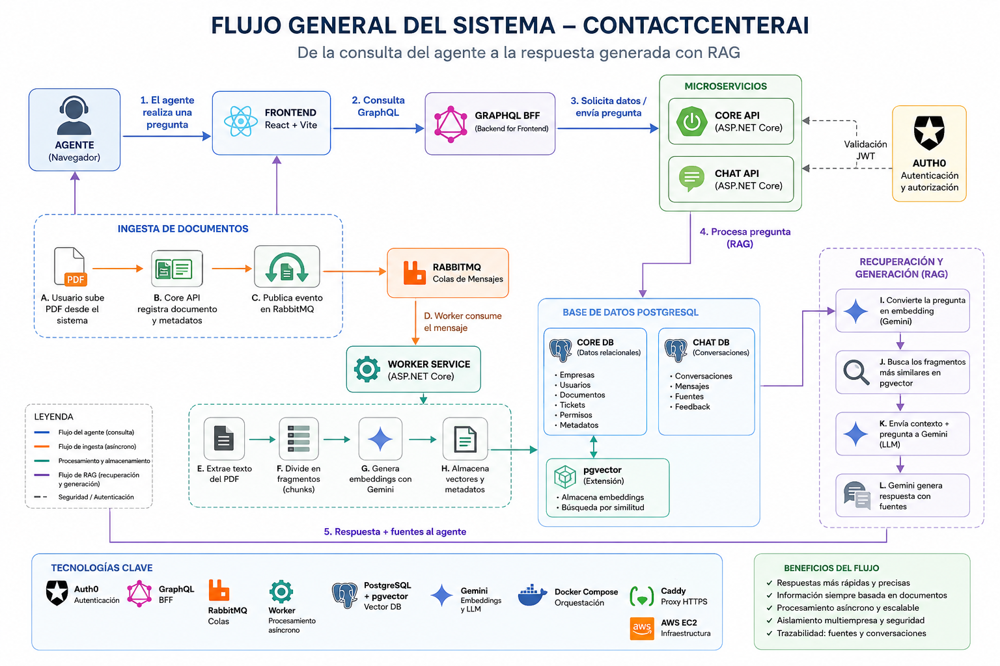

# ContactCenterAI

Plataforma multiempresa de asistencia para agentes de contact center, con recuperación aumentada por generación (RAG) sobre documentos PDF.

[](https://github.com/kvrodriguezg/contactcenter-ai/actions/workflows/ci.yml)
[](https://github.com/kvrodriguezg/contactcenter-ai/actions/workflows/codeql.yml)
[](https://dotnet.microsoft.com/)
[](https://nodejs.org/)
[](https://docs.docker.com/compose/)

**Estado:** proyecto académico finalizado (Ingeniería en Desarrollo de Software).

---

## Vista general

ContactCenterAI resuelve la necesidad de que un agente de soporte obtenga respuestas fundamentadas en la documentación interna de su empresa, sin mezclar información entre tenants.

| Aspecto | Detalle |
|---------|---------|
| Problema | Consultas repetitivas y respuestas inconsistentes frente a políticas y procedimientos en PDF |
| Usuarios | SuperAdmin, CompanyAdmin y Agent en un modelo multiempresa |
| Funcionamiento | El agente carga PDF, un Worker los indexa de forma asíncrona y el Chat API responde con contexto recuperado por similitud semántica |

---

## Demostración visual

### Arquitectura general



### Capturas de pantalla

Espacio reservado para capturas futuras de la interfaz (login, documentos, chat RAG y tickets). Añadirlas en `docs/assets/capturas/` cuando estén disponibles.

Documentación adicional: [docs/README.md](docs/README.md) · [Manual técnico](docs/final/Manual_Tecnico.md) · [Manual de usuario](docs/final/Manual_Usuario.md)

---

## Funcionalidades

- Autenticación **local (JWT HS256)** para desarrollo y **Auth0 (JWT RS256)** para escenarios productivos configurados
- Roles y permisos: `SuperAdmin`, `CompanyAdmin`, `Agent`
- Multi-tenancy por `CompanyId` (aislamiento de documentos, chat y tickets)
- Gestión de empresas y usuarios
- Carga, listado y almacenamiento de documentos PDF
- Procesamiento asíncrono: extracción de texto, fragmentación (chunks) y embeddings
- Mensajería opcional con **RabbitMQ** (`MESSAGING_ENABLED`)
- **Worker Service** consumidor de eventos / polling de documentos pendientes
- Embeddings y generación con **Google Gemini**
- Persistencia **PostgreSQL** con extensión **pgvector**
- Chat RAG con historial de conversaciones y **fuentes citadas** por respuesta
- **GraphQL BFF** (HotChocolate) para consultas agregadas hacia Core y Chat
- Tickets y escalamiento
- Timestamps de auditoría en entidades de dominio (`AuditableEntity`); no existe un módulo separado de auditoría forense

---

## Arquitectura

| Componente | Rol |
|------------|-----|
| Frontend (React + Vite + MUI) | SPA de agentes y administración |
| GraphQL BFF (`:8082`) | Fachada GraphQL hacia Core API y Chat API |
| Core API (`:8080`) | Auth, empresas, usuarios, documentos, búsqueda, tickets |
| Chat API (`:8081`) | Conversaciones RAG (modo External) |
| Worker | Extracción PDF, chunks, embeddings, consumidores RabbitMQ |
| RabbitMQ | Eventos de procesamiento documental y escalamiento (feature flag) |
| PostgreSQL Core + pgvector | Tenancy, documentos, embeddings y búsqueda semántica |
| PostgreSQL Chat | Conversaciones, mensajes y fuentes |
| Gemini | Embeddings y modelo de chat |
| Auth0 | Identidad externa (cuando `AUTH_PROVIDER=Auth0`) |
| Docker Compose | Orquestación local y base del despliegue |
| Caddy | Reverse proxy HTTPS en borde (snippet incluido) |
| AWS EC2 | Destino del workflow de CD por SSH |

Detalle: [docs/architecture/](docs/architecture/).

```text
Frontend (web)
    ├── Core API (:8080)     → db (PostgreSQL + pgvector)
    ├── Chat API (:8081)     → chat-db (PostgreSQL)
    ├── GraphQL BFF (:8082)  → Core API + Chat API
    └── Worker               → db + RabbitMQ + almacenamiento PDF
```

---

## Flujo de ingesta documental

1. El agente autenticado sube un PDF desde el frontend.
2. Core API valida tipo/tamaño, persiste metadatos y almacena el archivo fuera de Git (`storage/documents`).
3. Si la mensajería está habilitada, publica un evento en RabbitMQ; en caso contrario el Worker usa polling.
4. El Worker extrae texto, genera chunks y solicita embeddings a Gemini.
5. Los vectores y metadatos se guardan en PostgreSQL/pgvector asociados al `CompanyId` del documento.

---

## Flujo de consulta RAG

1. El agente envía una pregunta al Chat API (o al chat embebido según configuración).
2. La pregunta se convierte en embedding con Gemini.
3. Se ejecuta búsqueda por similitud en pgvector filtrada por empresa.
4. El contexto recuperado y la pregunta se envían al modelo de chat de Gemini.
5. La respuesta vuelve al frontend junto con las fuentes utilizadas (`SourcesJson`).

---

## Stack tecnológico

| Capa | Tecnología |
|------|------------|
| Frontend | React 19, Vite 6, TypeScript, Material UI 6, Auth0 SPA SDK |
| Core API | ASP.NET Core 9, Clean Architecture, CQRS + MediatR, EF Core, Serilog |
| Chat API | ASP.NET Core 9 (bounded context propio) |
| GraphQL BFF | HotChocolate |
| Persistencia | PostgreSQL 16, pgvector (`vector(1536)`) |
| Worker | BackgroundService + consumidores RabbitMQ |
| IA | Google Gemini API (embeddings y chat) |
| Mensajería | RabbitMQ 3 |
| Infraestructura | Docker Compose, nginx (imagen web), Caddy (snippet), GitHub Actions, AWS EC2 |

---

## Estructura del repositorio

```text
.
├── .github/workflows/     # CI, CodeQL y CD a EC2
├── deploy/                # Dockerfiles, nginx, Caddy, init SQL
├── deployment/Docker/     # Compose y documentación de despliegue
├── docs/                  # Arquitectura, seguridad, evidencia académica
├── scripts/               # SQL de instalación y seed de desarrollo
├── src/
│   ├── backend/           # Api, Bff, Chat, Worker, Domain, Application, Infrastructure
│   └── frontend/contact-center-web/
├── tests/                 # Pruebas unitarias e integración
├── docker-compose.yml
├── .env.example
└── README.md
```

---

## Requisitos

- .NET 9 SDK
- Node.js 22+
- Docker y Docker Compose v2
- Cuenta en [Google AI Studio](https://aistudio.google.com/) para obtener `GEMINI_API_KEY`
- (Opcional producción) Tenant Auth0, instancia AWS EC2 y Caddy para HTTPS

---

## Configuración local

### Bash

```bash
cp .env.example .env
```

### PowerShell

```powershell
Copy-Item .env.example .env
```

Editar `.env` y completar al menos `GEMINI_API_KEY`. No publicar ni versionar ese archivo.

### Levantar con Docker Compose

```bash
docker compose up -d
docker compose ps
```

| Servicio | URL típica (local) |
|----------|--------------------|
| Frontend | http://localhost:5173 |
| Core API / Swagger | http://localhost:8080/swagger |
| Core health | http://localhost:8080/health |
| Chat API health | http://localhost:8081/health |
| GraphQL BFF | http://localhost:8082/graphql |
| PostgreSQL Core | localhost:5432 |
| PostgreSQL Chat | localhost:5433 |
| RabbitMQ AMQP | localhost:5672 |
| RabbitMQ Management | http://127.0.0.1:15672 (solo loopback) |

`POSTGRES_PASSWORD=postgres` y `RABBITMQ` `guest`/`guest` son **solo para desarrollo local**. No usarlas en producción.

### Credenciales demostrativas (solo Development + Local)

Válidas únicamente cuando `ASPNETCORE_ENVIRONMENT=Development` y `AUTH_PROVIDER=Local`. El seeder de la aplicación **no** se ejecuta fuera de Development. Con Auth0, el login local responde **410**.

| Usuario | Contraseña | Rol |
|---------|------------|-----|
| admin@contactcenterai.cl | Admin123* | SuperAdmin |
| agente@contactcenterai.cl | Agent123* | Agent |

---

## Ejecución sin Docker

1. Provisionar PostgreSQL (Core con pgvector y base Chat) y, si aplica, RabbitMQ.
2. Configurar connection strings y variables equivalentes a `.env.example` en `appsettings.Development.json` o variables de entorno.
3. Backend (desde la raíz del repositorio):

```bash
dotnet restore src/backend/ContactCenterAI.sln
dotnet run --project src/backend/ContactCenterAI.Api
dotnet run --project src/backend/ContactCenterAI.Chat.Api
dotnet run --project src/backend/ContactCenterAI.Bff
dotnet run --project src/backend/ContactCenterAI.Worker
```

4. Frontend:

```bash
cd src/frontend/contact-center-web
npm ci
npm run dev
```

---

## Pruebas

### Backend

```bash
dotnet restore src/backend/ContactCenterAI.sln
dotnet build src/backend/ContactCenterAI.sln --configuration Release
dotnet test src/backend/ContactCenterAI.sln --configuration Release
```

### Frontend

```bash
cd src/frontend/contact-center-web
npm ci
npm run build
npm run lint
```

### Integración

Existen proyectos de prueba de API, Infrastructure, BFF y Chat bajo `tests/`, ejecutados por la solución .NET anterior. Evidencia académica: [docs/sumativa-2/](docs/sumativa-2/).

---

## CI/CD

| Workflow | Función |
|----------|---------|
| `.github/workflows/ci.yml` | Restore, build, test backend, build frontend e imágenes Docker |
| `.github/workflows/codeql.yml` | Análisis estático CodeQL (C# y JavaScript/TypeScript) |
| `.github/workflows/deploy.yml` | Despliegue por SSH a AWS EC2 (push a `main` o disparo manual) |

Los secretos de despliegue (`EC2_HOST`, `EC2_USER`, `EC2_SSH_KEY`) viven exclusivamente en **GitHub Secrets**. El `.env` de producción permanece en la instancia EC2 y no se versiona. Este README no publica IP de servidor ni URL HTTPS pública.

---

## Seguridad

- Variables sensibles solo en `.env` local o en el host de despliegue; `.env.example` contiene placeholders
- Aislamiento multi-tenant por `CompanyId` resuelto desde el perfil local, no desde claims arbitrarios del token
- JWT local (Development) o validación Auth0 (issuer/audience/JWKS)
- Validación de tipo y tamaño de PDF; almacenamiento fuera del control de versiones
- CORS configurable mediante `WEB_ORIGIN` / `Cors__Origins`
- HTTPS de borde mediante Caddy en despliegues preparados para ello
- Secretos de CI/CD en GitHub Secrets; no incrustar claves SSH ni hosts en el workflow
- Datos de demostración limitados a Development; rotar cualquier clave real si se expone accidentalmente
- Las variables `VITE_*` del frontend son públicas en el navegador: no colocar secretos allí

---

## Limitaciones conocidas

- El despliegue en EC2 depende de secretos y de un `.env` en el servidor; no se documenta aquí una URL pública activa
- RabbitMQ y el procesamiento por eventos son opcionales (`MESSAGING_ENABLED`); el polling puede usarse como fallback
- No hay módulo de feedback explícito del usuario sobre respuestas del chat (sí hay fuentes citadas)
- No hay panel de auditoría forense dedicado; la trazabilidad se basa en entidades auditables, logs y fuentes RAG
- Cognito, Azure OpenAI y Bedrock no forman parte de la solución vigente (solo referencias históricas en documentación)
- Las credenciales seed y `guest`/`postgres` no son aptas para producción

---

## Próximas mejoras

- Capturas de pantalla y guía visual de demo en el README
- Observabilidad (métricas y tracing) unificada entre Core, Chat y Worker
- Hardening de producción: secretos gestionados, políticas de contraseña y rotación documentada
- Pruebas E2E automatizadas del flujo Auth0 + carga PDF + chat RAG
- Feedback de utilidad sobre respuestas del asistente

---

## Contexto académico e independencia

ContactCenterAI fue desarrollado como proyecto académico final de Ingeniería en Desarrollo de Software. El repositorio utiliza exclusivamente código, configuraciones, documentación y datos ficticios creados para fines educativos.

El proyecto no representa una implementación oficial de una empresa ni contiene información, código fuente, documentación, datos, credenciales, procesos o activos pertenecientes a empleadores, clientes reales o terceros.

---

## Autoría

- **Katlheen Rodríguez**
- GitHub: [https://github.com/kvrodriguezg](https://github.com/kvrodriguezg)

---

## Licencia

Todos los derechos reservados. El código se publica con fines de evaluación y portafolio. No se concede autorización para uso comercial, redistribución o creación de obras derivadas sin autorización expresa de la autora.
