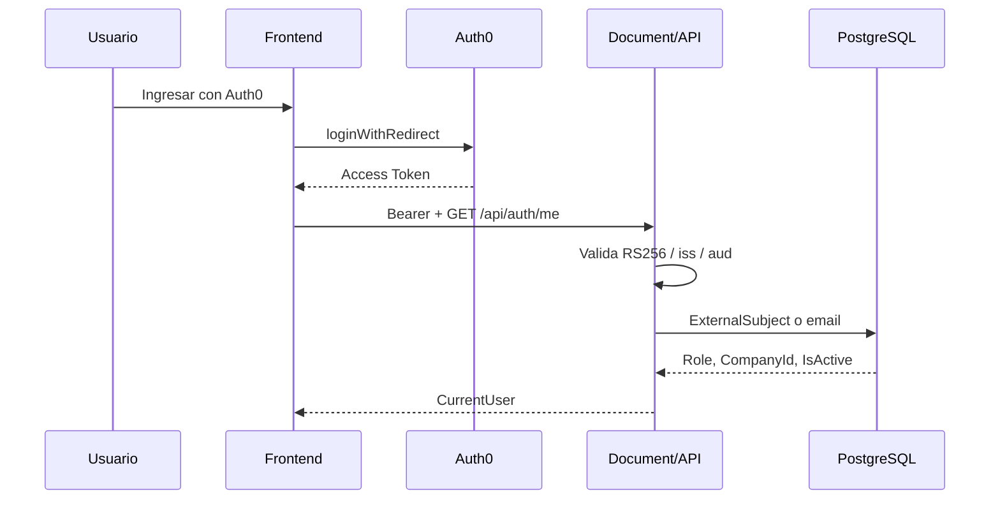

# Integración Auth0 — ContactCenterAI

Documento de implementación del Identity as a Service con Auth0, compatible con el login local mediante feature flag.

## Objetivo

- Auth0 autentica (identidad y tokens).
- PostgreSQL local autoriza (rol, empresa, `IsActive`).
- `AUTH_PROVIDER=Local|Auth0` conmuta el modo sin eliminar el login local.

## Feature flags

| Variable | Valores | Efecto |
|----------|---------|--------|
| `AUTH_PROVIDER` | `Local` (default), `Auth0` | Backend: esquema JWT |
| `VITE_AUTH_PROVIDER` | `Local` (default), `Auth0` | Frontend: formulario vs Auth0 |

Variables Auth0 (sin secretos en git):

```text
AUTH0_DOMAIN=
AUTH0_AUDIENCE=https://contactcenterai-api
VITE_AUTH0_DOMAIN=
VITE_AUTH0_CLIENT_ID=
VITE_AUTH0_AUDIENCE=https://contactcenterai-api
VITE_AUTH0_REDIRECT_URI=
```

## Flujo Local (default)

1. Usuario envía email/password a `POST /api/auth/login`.
2. Backend verifica `PasswordHash` y emite JWT HS256 propio.
3. Frontend guarda el token vía `LocalTokenProvider`.
4. `GET /api/auth/me` resuelve el perfil local por `User.Id` del claim.
5. `CompanyId` y `Role` salen siempre de la base local (middleware `LocalUserResolutionMiddleware`).

## Flujo Auth0

1. Frontend muestra **Ingresar con Auth0** → `loginWithRedirect`.
2. Auth0 emite access token RS256 (audience API).
3. Frontend usa `Auth0TokenProvider` + `getAccessTokenSilently`.
4. Backend valida JWT con Authority `https://{AUTH0_DOMAIN}/`, audience exacto, issuer, lifetime; `RequireHttpsMetadata` en producción.
5. Middleware resuelve usuario local:
   - por `ExternalSubject` = claim `sub`
   - fallback temporal por email → asocia `ExternalSubject`
   - rechaza inactivos o no registrados
6. `POST /api/auth/login` responde **410 Gone** (no acepta contraseñas locales).



## Perfil local (`users`)

Campos añadidos (migración `AddExternalIdentityFields`):

- `ExternalSubject` (nullable, único)
- `AuthenticationProvider` (`Local` | `Auth0`)
- `LastLoginAt` (nullable)

Se conservan `PasswordHash`, `LoginCommand` y el login local cuando `AUTH_PROVIDER=Local`.

## Configuración Auth0 (manual en consola)

1. Crear Application tipo SPA.
2. Allowed Callback URLs: origen del frontend.
3. Allowed Logout URLs: origen del frontend.
4. Crear API con identifier `https://contactcenterai-api`.
5. Autorizar la SPA a solicitar esa audience.
6. Crear usuarios en Auth0 con el **mismo email** que en `users` (o preasignar `ExternalSubject`).

## Rollback

1. `AUTH_PROVIDER=Local`
2. `VITE_AUTH_PROVIDER=Local`
3. Redeploy / reiniciar API y web
4. Login local vuelve a operar; no requiere revertir la migración

## Archivos clave

- `Infrastructure/Identity/AuthenticationSettings.cs`
- `Infrastructure/Identity/Auth0Settings.cs`
- `Infrastructure/Identity/LocalUserResolver.cs`
- `Infrastructure/Identity/LocalUserResolutionMiddleware.cs`
- `Infrastructure/DependencyInjection.cs`
- Frontend: `authConfig.ts`, `tokenProvider.ts`, `AuthContext.tsx`
