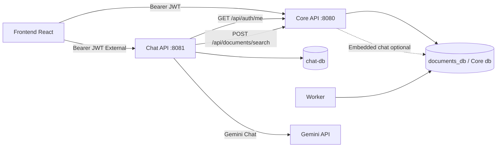

# Microservicio Chat/RAG — ContactCenterAI

## Diagrama

## Bounded contexts

| Contexto | Owner | Datos |
|----------|-------|-------|
| Core | Core API + Worker | companies, users, documents, chunks, embeddings |
| Chat | Chat API | conversations, conversation_messages |

## Propiedad de datos

- `chat-db`: solo tablas de Chat.
- Core DB: sin dependencia runtime desde Chat API.
- Entidades EF **no** se comparten.

## Comunicación HTTP

1. Chat valida JWT (Local o Auth0).
2. Propaga Bearer a Core `/api/auth/me` → perfil local (UserId, Role, CompanyId).
3. Propaga Bearer a Core `/api/documents/search` → hits con `Content` completo.
4. Gemini genera respuesta.
5. Persiste en `chat-db`.

## Autenticación

`AUTH_PROVIDER=Local|Auth0` en Chat API (misma audiencia Auth0 que Core).

## Aislamiento tenant

Conversaciones filtradas por `CompanyId` + `ExternalUserId` del perfil Core. Sin `CompanyId` → 401.

## Feature flag

| Modo | Frontend | Core Chat endpoints |
|------|----------|---------------------|
| `Embedded` (default) | Core `:8080` | Activos |
| `External` | Chat `:8081` | **410 Gone** |

Entidades/migraciones Chat del Core se conservan temporalmente para rollback.

## Fallos

| Fallo | Respuesta |
|-------|-----------|
| Core caído | Chat **503** controlado; no persiste respuesta incompleta |
| Gemini caído | **502** `ChatAiException` |
| Token inválido/ausente | **401** |

## Rollback

`CHAT_SERVICE_MODE=Embedded` + `VITE_CHAT_SERVICE_MODE=Embedded`.
