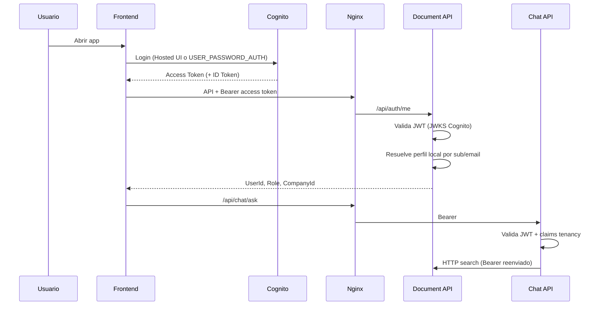

# Plan de integración Amazon Cognito — ContactCenterAI

Plan de diseño. **No implementar Cognito en esta etapa.**  
El login local JWT actual debe permanecer disponible mediante feature flags hasta validación completa.

---

## 1. Objetivos

1. Usar Amazon Cognito como Identity as a Service (credenciales, tokens, políticas).
2. Mantener el perfil de aplicación (empresa, rol, activo) en `documents_db`.
3. Validar JWT de Cognito en Document API y Chat API.
4. No romper el despliegue estable actual ni eliminar `/api/auth/login` local prematuramente.
5. Frontend: un solo origen (Nginx); autenticación transparente para el resto de APIs.

---

## 2. Estado actual de autenticación

| Elemento | Implementación actual |
|----------|------------------------|
| Login | `POST /api/auth/login` → verifica `PasswordHash` → emite JWT HS256 |
| Claims | `sub`/`NameIdentifier` = `User.Id`, `email`, `role`, `companyId` |
| Validación | `AddJwtBearer` con `Jwt__SecretKey` simétrico |
| Perfil | `GET /api/auth/me` desde BD |
| Frontend | `localStorage` token + `Authorization: Bearer` |
| Roles | Enum local `SuperAdmin`, `CompanyAdmin`, `Agent` |

Archivos clave (referencia, no modificar ahora):

- `Infrastructure/Identity/JwtTokenService.cs`
- `Infrastructure/Identity/CurrentUserService.cs`
- `Infrastructure/DependencyInjection.cs` (`AddApiAuthentication`)
- `Application/Auth/Commands/Login/LoginCommandHandler.cs`
- Frontend: `shared/api/client.ts`, `features/auth/AuthContext.tsx`

---

## 3. Modelo objetivo Cognito + perfil local

### Mapeo de identidad

| Cognito | Perfil local (`users`) |
|---------|-------------------------|
| `sub` | Columna nueva `CognitoSub` **o** `Id` = Guid parseado de `sub` |
| `email` | `Email` (sincronizado en primer login / provisioning) |
| — | `CompanyId`, `Role`, `IsActive` |

Recomendación académica (simple):

1. Añadir `CognitoSub` (string, único, nullable) en etapa de implementación.
2. En primer login Cognito exitoso: upsert de perfil local (o pre-provision por admin).
3. Claims de rol/empresa: preferir leer perfil local en Document API; opcionalmente emitir claims custom vía Pre Token Generation trigger (fase avanzada).

---

## 4. Cambios necesarios en autenticación (cuando se implemente)

### 4.1 Feature flags (obligatorio antes de cortar)

| Flag | Efecto |
|------|--------|
| `Auth__Mode=Local` | Solo JWT propio (comportamiento actual) |
| `Auth__Mode=Cognito` | Solo Cognito JWKS |
| `Auth__Mode=Hybrid` | Acepta ambos esquemas (transición) |
| `Auth__EnableLocalLogin=true/false` | Expone o no `POST /api/auth/login` |
| Frontend `VITE_AUTH_MODE` | `local` \| `cognito` \| `hybrid` |

### 4.2 Document API / Chat API

- Configurar `JwtBearer` con `Authority` = Cognito User Pool issuer (`https://cognito-idp.{region}.amazonaws.com/{userPoolId}`).
- `ValidAudience` = App Client ID (o `client_id` según token type).
- Validación por JWKS (sin `SecretKey` simétrico para tokens Cognito).
- En Hybrid: registrar dos esquemas o policy scheme que pruebe Cognito y luego Local.
- `CurrentUserService`: mapear `sub` Cognito → usuario local (cache corto opcional).
- Roles: seguir leyendo `Role` local hasta que Cognito grupos estén sincronizados.

### 4.3 Login local (conservar)

- No eliminar `LoginCommandHandler` ni `PasswordHasher` en las primeras etapas.
- Desactivar solo por flag cuando Cognito esté validado en staging/producción.

### 4.4 Chat API

- No implementa login; solo valida JWT.
- Debe entender los mismos claims / resolver el mismo `UserId` lógico que Document API (idealmente el GUID local, no solo el `sub` crudo, vía claim custom o introspección mínima).

### 4.5 Worker

- No requiere autenticación de usuario.
- No necesita Cognito.

---

## 5. Cambios necesarios en frontend (cuando se implemente)

| Área | Cambio |
|------|--------|
| Auth | Integrar Amplify Auth **o** `amazon-cognito-identity-js` / OIDC (elegir una; preferir OIDC simple si se evita Amplify por tamaño académico) |
| Token storage | Access token Cognito en memoria o `localStorage` (mismo patrón actual) |
| `client.ts` | Seguir enviando `Authorization: Bearer`; sin cambio de paths si Nginx unifica origen |
| LoginPage | Condicional: formulario local vs redirect Hosted UI / SRP |
| `/api/auth/me` | Sigue siendo fuente de `Role` y `CompanyId` |
| Logout | Cognito global sign-out + clear token local |
| Env | `VITE_COGNITO_USER_POOL_ID`, `VITE_COGNITO_CLIENT_ID`, `VITE_COGNITO_REGION`, `VITE_AUTH_MODE` — **nunca** secretos de app confidential en frontend |

El App Client del SPA debe ser **público** (sin client secret).

---

## 6. Recursos AWS Cognito a crear (etapa futura)

1. User Pool (política password alineada al proyecto).
2. App Client SPA (PKCE / Hosted UI o USER_PASSWORD_AUTH solo si se acepta el riesgo académico).
3. Dominio Hosted UI (opcional).
4. Grupos Cognito opcionales (`SuperAdmin`, etc.) — fase 2.
5. IAM mínimo: solo quien despliega crea el pool; las APIs solo leen JWKS público.

Secretos (client secret si hubiera backend confidential client) en variables de entorno / SSM — **nunca** en git ni `.env` versionado.

---

## 7. Provisioning de usuarios

Estrategia recomendada (simple):

1. **Admin crea usuario** en Cognito (consola/CLI/API) con email.
2. Document API crea/actualiza perfil local con `CognitoSub`, `CompanyId`, `Role`.
3. Usuario completa temporary password / invite.

Alternativa (más compleja): registro self-service + Post Confirmation Lambda para crear perfil — **fuera del MVP académico** salvo necesidad.

Migración de usuarios existentes:

1. Exportar emails/roles/companies desde BD actual.
2. Crear usuarios Cognito (sin migrar hashes ASP.NET Identity — no son compatibles directamente con Cognito).
3. Forzar reset de password o invite.
4. Vincular `CognitoSub` al `users.Id` existente.

---

## 8. Seguridad

- Validar `iss`, `aud`/`client_id`, `exp`, firma JWKS.
- Clock skew acotado.
- HTTPS obligatorio en producción.
- No loguear tokens.
- CORS solo orígenes del frontend/gateway.
- Rate limiting en Cognito (built-in) + considerar límites en Nginx para `/login`.

---

## 9. Criterios de aceptación Cognito

- [ ] Login Cognito emite token aceptado por Document API y Chat API.
- [ ] `/api/auth/me` resuelve rol y empresa correctos.
- [ ] Agente no accede a datos de otra empresa.
- [ ] Login local sigue funcionando con `Auth__Mode=Hybrid` o `Local`.
- [ ] Con Cognito caído y modo Local, la app académica puede operar.
- [ ] Ningún secreto Cognito en el repositorio.

---

## 10. Rollback de autenticación

| Situación | Acción |
|-----------|--------|
| Tokens Cognito inválidos masivos | `Auth__Mode=Local` + `VITE_AUTH_MODE=local`; redeploy config |
| Perfiles sin `CognitoSub` | Bloquear modo Cognito-only; volver Hybrid |
| Frontend Hosted UI roto | Reactivar LoginPage local |
| User Pool mal configurado | No borrar pool a ciegas; apuntar Authority anterior o Local |

Criterio de rollback: **cualquier** fallo de login > umbral acordado (p. ej. 5 min) en staging → revertir flags sin redeploy de código de dominio.
)
