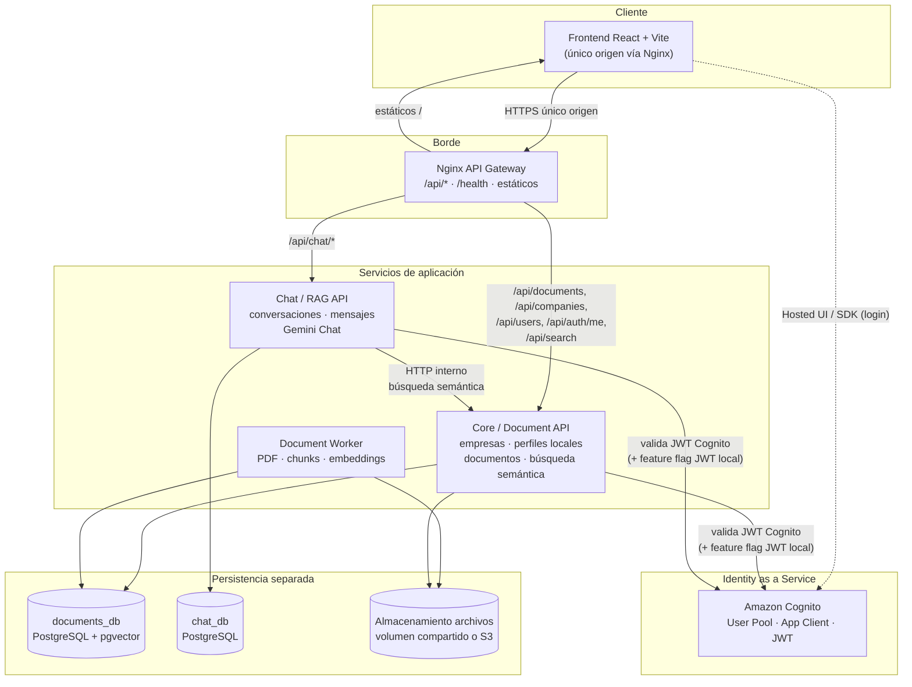

# Arquitectura objetivo — ContactCenterAI (microservicios + Cognito)

Documento de diseño. **No describe el estado actual**; define el destino de la migración controlada desde el monolito modular ASP.NET Core 9.

Estado actual: monolito modular (`ContactCenterAI.Api` + `ContactCenterAI.Worker`) con un único `ApplicationDbContext`, JWT propio y PostgreSQL + pgvector compartidos.

---

## 1. Diagrama de arquitectura objetivo



---

## 2. Servicios

| Servicio | Tipo | Puerto sugerido (Compose) | Health |
|----------|------|---------------------------|--------|
| `document-api` | ASP.NET Core 9 Web API | `8080` interno | `GET /health` |
| `chat-api` | ASP.NET Core 9 Web API | `8081` interno | `GET /health` |
| `document-worker` | Worker / BackgroundService | N/A | health opcional vía archivo o endpoint sidecar |
| `nginx` | API Gateway + estáticos | `80` / `443` | `GET /health` (upstream o local) |
| `web` | React build servido por Nginx o contenedor | detrás de Nginx | N/A |
| `documents-db` | PostgreSQL 16 + pgvector | `5432` interno | `pg_isready` |
| `chat-db` | PostgreSQL 16 | `5433` interno o instancia separada | `pg_isready` |
| Amazon Cognito | IaaS externo | — | AWS health / alarms |

---

## 3. Responsabilidades por bounded context

### 3.1 Core / Document API

- Empresas (`companies`) y estado de tenancy.
- Perfiles locales de usuario (mapeo Cognito `sub` → `User` interno, `CompanyId`, `Role` de aplicación, `IsActive`).
- Upload, listado y detalle de documentos.
- Búsqueda semántica sobre `document_chunks` (pgvector).
- Exposición de endpoints internos de búsqueda para Chat API (mismo contrato que hoy usa `ISemanticSearchService`, vía HTTP).
- Autenticación: validación de JWT (Cognito y/o local según feature flag).
- **No** posee conversaciones ni llama a Gemini Chat.

### 3.2 Document Worker

- Polling o cola de documentos en estado `Uploaded` / pendiente.
- Extracción de texto PDF.
- Chunking.
- Generación de embeddings (Gemini Embeddings).
- Persistencia de chunks + vectores en `documents_db`.
- Acceso a almacenamiento de archivos.
- **No** expone API pública al frontend.
- **No** conoce `chat_db`.

### 3.3 Chat / RAG API

- Conversaciones y mensajes.
- Orquestación RAG: pregunta → HTTP a Document API (search) → Gemini Chat → persistencia.
- Autenticación: misma política JWT que Document API.
- **No** escribe en `documents_db`.
- **No** lee embeddings ni tablas de documentos por conexión directa.

### 3.4 Amazon Cognito

- Identidad (email, password, MFA opcional, recuperación).
- Emisión de access/ID tokens (JWT).
- Grupos Cognito opcionales; el **rol de negocio** (`SuperAdmin`, `CompanyAdmin`, `Agent`) permanece en perfil local hasta decisión explícita de migrarlo a custom attributes / grupos.
- **No** almacena `CompanyId` de negocio como fuente de verdad de tenancy (salvo custom attribute sincronizado; ver `cognito-integration-plan.md`).

### 3.5 Nginx (API Gateway)

- Único origen para el navegador.
- Enrutamiento por path:
  - `/api/chat/*` → `chat-api`
  - `/api/*` restante (documents, companies, users, auth) → `document-api`
  - `/` → frontend estático
- Terminación TLS en despliegue.
- Timeouts y buffers adecuados para upload PDF y respuestas RAG.

---

## 4. Comunicación

| De | A | Protocolo | Auth | Notas |
|----|---|-----------|------|-------|
| Frontend | Nginx | HTTPS | Bearer JWT | Un solo `VITE_API_BASE_URL` (origen del gateway) |
| Nginx | document-api / chat-api | HTTP interno | Reenvío `Authorization` | Sin lógica de negocio en Nginx |
| Chat API | Document API | HTTP interno | Bearer del usuario **o** service token | Preferir reenviar JWT del usuario para conservar tenancy |
| Document Worker | documents_db | Npgsql | Connection string | Sin HTTP |
| APIs | Cognito | JWKS HTTPS | Validación issuer/audience | Sin secretos de cliente en APIs (salvo client credentials si se usan) |
| APIs / Worker | Gemini | HTTPS | API key | Solo Document API/Worker: embeddings; Chat API: chat |

Reglas:

1. **Prohibido** acceso cross-database (Chat no conecta a `documents_db`; Document no conecta a `chat_db`).
2. Chat obtiene contexto RAG **solo** vía HTTP al Document API.
3. El frontend **no** llama a puertos internos de cada API.

---

## 5. Despliegue

### 5.1 Local (Docker Compose)

Servicios independientes, levantables por perfil o por nombre:

```text
docker compose up documents-db chat-db
docker compose up document-api document-worker
docker compose up chat-api
docker compose up nginx web
```

Variables de entorno por servicio (sin secretos en git): connection strings, Cognito Authority/Audience, Gemini, storage path, feature flags.

### 5.2 AWS (objetivo, no implementar en esta etapa)

- EC2 (o ECS más adelante) con Compose o systemd.
- Cognito User Pool en la misma cuenta/región.
- Nginx reverse proxy + certbot o ALB.
- Volúmenes o EFS/S3 para PDFs.
- Health checks por contenedor / target group.

### 5.3 CI (GitHub Actions)

Extender el pipeline actual para construir imágenes:

- `Dockerfile.document-api` (evolución de `Dockerfile.api`)
- `Dockerfile.chat-api` (nuevo)
- `Dockerfile.worker`
- `Dockerfile.web` / imagen Nginx gateway

---

## 6. Tolerancia a fallos

| Escenario | Comportamiento esperado |
|-----------|-------------------------|
| Document API caído | Chat responde 503 en `/ask` (no hay RAG); listado de conversaciones puede seguir si `chat_db` está sano |
| Chat API caído | Documentos, empresas y usuarios siguen disponibles |
| Worker caído | Upload OK; documentos permanecen en estado pendiente; búsqueda degrada hasta reprocesar |
| Cognito caído | Login Cognito falla; con feature flag, login local JWT puede seguir activo en transición |
| Gemini caído | Embeddings/chat fallan con error controlado; no corromper estado de BD |
| `documents_db` caído | Document API unhealthy; Chat degradado en RAG |
| `chat_db` caído | Solo Chat API unhealthy |

Health checks:

- Document API: DB `documents_db` (+ opcional Gemini configurado).
- Chat API: DB `chat_db` (+ opcional reachability Document API).
- Nginx: upstreams o endpoint local `/health`.

---

## 7. Límites de cada bounded context

### Documents (Core)

**Dentro:** companies, users (perfil local), refresh_tokens (mientras exista JWT local), documents, document_chunks, storage paths, embeddings, búsqueda semántica, procesamiento asíncrono (worker).

**Fuera:** conversation*, Gemini Chat completion, historial de Q&A.

**Contrato público hacia Chat:** búsqueda semántica por `companyId` + query + topK → lista de chunks/scores (equivalente a `SemanticSearchResultDto`).

### Chat (RAG)

**Dentro:** conversations, conversation_messages, orquestación ask, serialización de `SourcesJson`.

**Fuera:** escritura de documentos, embeddings, PDF, companies/users como dueño de datos (solo consume claims / IDs).

**Referencias externas (por ID, sin FK cross-DB):**

- `CompanyId` (owned by Documents)
- `UserId` (perfil local owned by Documents; identidad Cognito `sub` alineada)
- `DocumentId` / chunk refs en `SourcesJson` (owned by Documents)

### Identity (Cognito)

**Dentro:** credenciales, tokens, verificación de email, políticas de password.

**Fuera:** tenancy de negocio, documentos, chat. El vínculo es `sub` ↔ perfil local.

---

## 8. Mapeo desde el monolito actual

| Módulo actual | Destino |
|---------------|---------|
| `Application/Auth`, `Application/Users`, `Application/Companies` | Document API |
| `Application/Documents` + `ISemanticSearchService` | Document API |
| `Infrastructure/Documents/*`, Worker | Document Worker + Document API |
| `Application/Chat` | Chat API |
| `GeminiEmbeddingService` | Document API + Worker |
| `GeminiChatCompletionService` | Chat API |
| `ApplicationDbContext` (único) | `DocumentsDbContext` + `ChatDbContext` |
| JWT propio (`JwtTokenService`) | Cognito (+ flag login local) |
| Frontend `VITE_API_BASE_URL` → :8080 | → origen Nginx |

---

## 9. Principios de migración (resumen)

1. Mantener el monolito compilando y desplegable hasta el corte.
2. No eliminar login local hasta validar Cognito en staging.
3. Extraer Chat primero (menor acoplamiento de escritura; acoplamiento de lectura se sustituye por HTTP).
4. Separar bases después de estabilizar contratos HTTP.
5. Introducir Nginx como único origen antes del despliegue multi-servicio en AWS.
)
